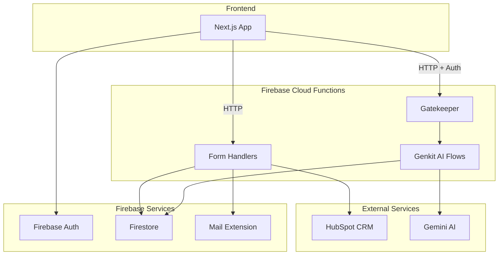
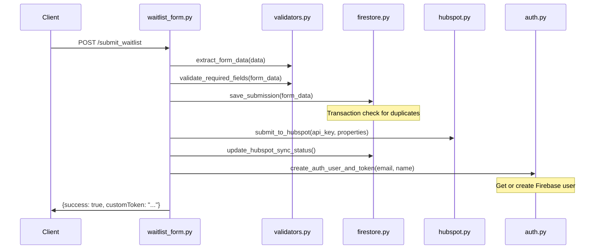
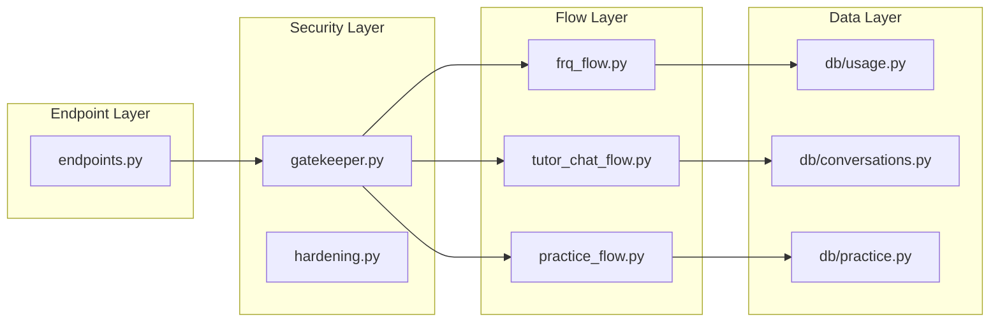

# Backend Architecture 📐

This document provides a deep dive into the CodeThe5 backend architecture.

---

## System Overview



---

## Entry Point: `main.py`

All Cloud Functions are exported from `main.py`:

```python
# Form endpoints (public or semi-protected)
submit_waitlist = handle_form_submit           # POST: Waitlist signup
reconcile_hubspot = reconcile_hubspot_submissions  # Scheduled: HubSpot sync
request_sign_in_link = send_sign_in_link       # POST: Passwordless login
submit_feedback = handle_feedback_submit        # POST: User feedback

# AI endpoints (protected via gatekeeper)
tutor_chat = tutor_chat_endpoint               # POST: AI tutoring
streaming_tutor = streaming_tutor_endpoint     # POST/SSE: Streaming chat
practice_serve = practice_serve_endpoint       # POST: Question serving
frq = frq_endpoint                             # POST: FRQ grading
health = health_endpoint                       # GET: Health check
```

---

## Core Modules

### 1. Configuration (`config.py`)

Centralizes all configuration:

```python
# API Configuration
HUBSPOT_API_BASE_URL = "https://api.hubapi.com/crm/v3/objects/contacts"
HUBSPOT_REQUEST_TIMEOUT = 10

# Firestore Collections
FIRESTORE_WAITLIST_COLLECTION = "waitlist-submissions"
FIRESTORE_MAIL_COLLECTION = "mail"
FIRESTORE_FEEDBACK_COLLECTION = "feedback-submissions"

# Input Validation Limits
MAX_FIELD_LENGTH = 500
MAX_NAME_LENGTH = 200
MAX_EMAIL_LENGTH = 254  # RFC 5321

# LLM Configuration
GEMINI_MODEL = "gemini-1.5-flash"
GEMINI_TEMPERATURE = 0.1
```

**Key functions:**

| Function | Purpose |
|----------|---------|
| `get_environment()` | Returns `"development"` or `"production"` |
| `get_cors_config()` | Returns CORS options based on environment |
| `get_required_secrets()` | Lists required Firebase secrets |

---

### 2. Custom Exceptions (`exceptions.py`)

```python
class ValidationError(Exception):
    """Raised when form data validation fails."""

class ConfigurationError(Exception):
    """Raised when required configuration is missing."""

class HubSpotError(Exception):
    """Raised when HubSpot API operations fail."""

class FirestoreError(Exception):
    """Raised when Firestore operations fail."""
```

Use these throughout the codebase for consistent error handling.

---

### 3. Utility Functions (`utils.py`)

Common utilities used across modules:

```python
# Email validation
validate_email(email: str) -> bool

# Length validation (raises ValueError)
validate_field_length(field_name: str, value: str, max_length: int)

# Name processing
split_name(name: str) -> Tuple[str, str]  # (first, last)

# String processing
sanitize_string(value: str | None) -> str
escape_html(value: str | None) -> str

# PII protection for logs
mask_email(email: str) -> str   # "d**n@example.com"
hash_email(email: str) -> str   # "a1b2c3d4@e5f6g7h8"
```

---

## Form Handlers (`forms/`)

### Request Flow



### Module Responsibilities

| Module | Responsibility |
|--------|----------------|
| `waitlist_form.py` | Main handler, coordinates all steps |
| `validators.py` | Input validation and sanitization |
| `firestore.py` | Database CRUD operations |
| `hubspot.py` | HubSpot API integration |
| `send_sign_in_link.py` | Passwordless login emails |

---

## AI System (`genkit/`)

### Architecture Overview



### Gatekeeper (`gatekeeper.py`)

The gatekeeper is a **security checkpoint** for all AI endpoints:

```python
@dataclass
class GatekeeperResult:
    user: AuthenticatedUser    # Verified user info
    app_check_verified: bool   # App Check status
    usage: Optional[dict]      # Current rate limit info

def gatekeeper(
    request: https_fn.Request,
    require_auth_check: bool = True,
    require_app_check_check: bool = False,
    action_type: str = "tutor",
) -> GatekeeperResult:
    """
    1. Verify Firebase Auth token
    2. Verify App Check token (optional)
    3. Check tier-based rate limits
    """
```

**Exception Hierarchy:**

```
GatekeeperError (base)
├── AuthenticationError  (401)
├── AppCheckError        (403)
└── RateLimitError       (429)
```

### Rate Limiting (`db/usage.py`)

Uses Firestore buckets for tracking:

```
Firestore Schema:
usage/{userId}/hourBuckets/{yyyyMMddHH}
usage/{userId}/dayBuckets/{yyyyMMdd}
usage/{userId}/weekBuckets/{yyyy-Www}
```

**Key Types:**

```python
class PlanTier(Enum):
    FREE = "FREE"
    PAID = "PAID"

class ActionType(Enum):
    TUTOR = "tutor"
    PRACTICE = "practice"
    FRQ_GRADING = "frq_grading"
    PRACTICE_SET = "practice_set"
```

**Key Functions:**

```python
# Check and increment usage (throws if over limit)
bump_usage_or_throw(user_id: str, action: ActionType, tier: PlanTier) -> dict

# Get user's current tier
get_user_tier(user_id: str) -> PlanTier
```

### AI Flows

Each flow follows this pattern:

```python
from codethe5_backend.genkit.config import get_ai

def my_flow(input_data: dict, api_key: str) -> dict:
    ai = get_ai()  # Cached Genkit instance
    
    # Build prompt
    prompt = build_prompt(input_data)
    
    # Call LLM
    response = ai.generate(
        model="googleai/gemini-2.0-flash",
        prompt=prompt,
    )
    
    # Parse and return
    return parse_response(response.text)
```

---

## Authentication (`auth.py`)

Handles Firebase Auth operations:

```python
# Create or get user, generate login token
create_auth_user_and_token(email: str, name: str) -> Tuple[str, str]

# Generate passwordless sign-in link
generate_email_sign_in_link(email: str) -> str

# Internal helpers
get_or_create_auth_user(email: str, name: str) -> str
generate_custom_token(uid: str) -> str
```

**Flow:**

1. User submits waitlist form
2. Backend creates/gets Firebase Auth user
3. Generates custom token
4. Frontend uses token to sign in immediately

---

## Email System

### Templates (`emails.py`)

Provides branded HTML email templates:

```python
def render_welcome_email(first_name: str) -> EmailContent:
    """Returns {subject: str, html: str}"""

def render_login_email(sign_in_link: str) -> EmailContent:
    """Returns {subject: str, html: str}"""
```

### Sending Emails

Emails are queued via Firestore Trigger Email extension:

```python
# In firestore.py
def queue_welcome_email(form_data: Dict[str, str]):
    """Add to 'mail' collection, triggers email send."""
    db.collection("mail").add({
        "to": form_data["email"],
        "message": {
            "subject": "Welcome to CodeThe5!",
            "html": html_content,
        }
    })
```

---

## Security Layers

### 1. CORS Configuration

```python
# Development: Allow all origins
cors_origins="*"

# Production: Allowed origins only
cors_origins=["https://codethe5.com", "https://codethe5.web.app"]
```

### 2. Input Validation

All inputs go through:

1. **Length checks** - Prevent DoS via oversized inputs
2. **Sanitization** - Strip whitespace, escape HTML
3. **Format validation** - Email regex, required fields

### 3. Authentication

AI endpoints require valid Firebase ID tokens in the `Authorization` header:

```
Authorization: Bearer <firebase-id-token>
```

### 4. Rate Limiting

Tier-aware limits prevent abuse:

- Tracked in Firestore buckets
- Checked before any AI call
- Returns 429 with reset time

---

## Error Handling Pattern

All handlers follow this pattern:

```python
def endpoint(req: https_fn.Request):
    try:
        # Business logic here
        return https_fn.Response(json.dumps({"success": True}))
        
    except ValidationError as e:
        return https_fn.Response(
            json.dumps({"error": str(e)}),
            status=400
        )
    except AuthenticationError as e:
        return https_fn.Response(
            json.dumps({"error": str(e)}),
            status=401
        )
    except Exception as e:
        logger.exception("Unexpected error")
        return https_fn.Response(
            json.dumps({"error": "Internal server error"}),
            status=500
        )
```

---

## Firestore Collections

| Collection | Purpose | Key Fields |
|------------|---------|------------|
| `waitlist-submissions` | Signup data | email, name, role, hubspot_synced |
| `mail` | Email queue | to, message.subject, message.html |
| `feedback-submissions` | User feedback | rating, context, details |
| `users` | User profiles | planTier, createdAt |
| `usage/{uid}/hourBuckets` | Rate limit tracking | tutor, practice, timestamp |
| `conversations/{uid}` | AI chat history | messages, threadId |

---

## Deployment

### Pre-deploy Checks

Deployment runs `scripts/predeploy.sh` which:

1. Activates virtual environment
2. Runs `pytest` with 95% coverage gate
3. **Blocks deployment if tests fail**

### Deploy Commands

```bash
# Full deployment (functions + hosting)
firebase deploy

# Functions only
firebase deploy --only functions

# Single function
firebase deploy --only functions:submit_waitlist
```

### Required Secrets

Set via Firebase Secret Manager:

```bash
firebase functions:secrets:set HUBSPOT_API_KEY
firebase functions:secrets:set GEMINI_API_KEY
firebase functions:secrets:set PRODUCTION_ORIGIN
```

---

## Next Steps

- [Development Workflows](./DEVELOPMENT_WORKFLOWS.md) - Day-to-day development
- [Testing Guide](./TESTING.md) - Writing and running tests
