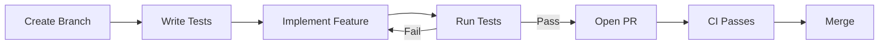

# Backend Development Guide 🛠️

Day-to-day development workflows, patterns, and best practices.

---

## Development Workflow

### Before You Start

1. Pull latest changes: `git pull origin main`
2. Activate virtual environment: `source functions/venv/bin/activate`
3. Start emulators: `firebase emulators:start`

### Feature Development Cycle



---

## Working with Tests

### Test Location

Tests live in `functions/tests/` and follow the naming convention `test_<module>.py`:

```
tests/
├── conftest.py              # Shared fixtures
├── test_waitlist_form.py    # Tests for waitlist_form.py
├── test_validators.py       # Tests for validators.py
├── test_hubspot.py          # Tests for hubspot.py
└── ...
```

### Running Tests

```bash
cd functions

# Run all tests
pytest

# Run with verbose output
pytest -v

# Run specific test file
pytest tests/test_validators.py

# Run specific test function
pytest tests/test_validators.py::test_validate_email

# Run tests matching a pattern
pytest -k "hubspot"

# Run with coverage report in browser
pytest --cov-report=html && open htmlcov/index.html
```

### Writing Tests

Follow this pattern:

```python
# tests/test_my_module.py

import pytest
from codethe5_backend.my_module import my_function

class TestMyFunction:
    """Tests for my_function()."""
    
    def test_success_case(self):
        """Should return expected result for valid input."""
        result = my_function("valid input")
        assert result == "expected output"
    
    def test_error_case(self):
        """Should raise ValueError for invalid input."""
        with pytest.raises(ValueError, match="specific error message"):
            my_function("invalid input")
    
    def test_edge_case(self):
        """Should handle empty string."""
        result = my_function("")
        assert result == ""
```

### Using Fixtures

Common fixtures are in `conftest.py`:

```python
# Use mock Firestore
def test_save_submission(mock_firestore_client, sample_form_data):
    save_submission(sample_form_data)
    # Verify mock was called
    mock_firestore_client.collection.assert_called_with("waitlist-submissions")

# Use mock HTTP request
def test_endpoint(mock_https_request):
    request = mock_https_request(
        method="POST",
        json_data={"email": "test@example.com"},
    )
    response = my_endpoint(request)
    assert response.status == 200
```

---

## Adding a New Feature

### Example: Adding a New Form Endpoint

1. **Create the handler** (`forms/new_form.py`):

```python
"""Handler for new form submissions."""

import logging
from firebase_functions import https_fn, options
from codethe5_backend.config import get_cors_config
from codethe5_backend.exceptions import ValidationError
from codethe5_backend.forms.validators import validate_required_fields

logger = logging.getLogger(__name__)

@https_fn.on_request(
    cors=get_cors_config(),
    memory=256,
)
def handle_new_form(req: https_fn.Request) -> https_fn.Response:
    """Handle new form submission."""
    try:
        data = req.get_json()
        validate_required_fields(data, ["email", "message"])
        
        # Process the form...
        
        return https_fn.Response(
            json.dumps({"success": True}),
            status=200,
            content_type="application/json",
        )
    except ValidationError as e:
        return https_fn.Response(
            json.dumps({"error": str(e)}),
            status=400,
        )
```

2. **Export in `main.py`**:

```python
from codethe5_backend.forms.new_form import handle_new_form
new_form = handle_new_form
```

3. **Write tests** (`tests/test_new_form.py`):

```python
import pytest
from codethe5_backend.forms.new_form import handle_new_form

class TestNewFormHandler:
    def test_success(self, mock_https_request, mock_firestore_client):
        request = mock_https_request(
            json_data={"email": "test@example.com", "message": "Hello"}
        )
        response = handle_new_form(request)
        assert response.status == 200
    
    def test_missing_email(self, mock_https_request):
        request = mock_https_request(json_data={"message": "Hello"})
        response = handle_new_form(request)
        assert response.status == 400
```

4. **Run tests**: `pytest tests/test_new_form.py`

---

## Adding a New AI Endpoint

### Example: Adding a New Genkit Flow

1. **Create the flow** (`genkit/flows/new_flow.py`):

```python
"""New AI flow for feature X."""

from dataclasses import dataclass
from typing import Optional
from codethe5_backend.genkit.config import get_ai

@dataclass
class NewFlowResult:
    success: bool
    output: str
    error: Optional[str] = None
    
    def to_dict(self):
        return {
            "success": self.success,
            "output": self.output,
            "error": self.error,
        }

async def new_flow(user_input: str, api_key: str) -> NewFlowResult:
    """Process user input with AI."""
    try:
        ai = get_ai()
        
        prompt = f"""
        You are a helpful assistant.
        User input: {user_input}
        
        Respond helpfully.
        """
        
        response = await ai.generate(prompt)
        
        return NewFlowResult(
            success=True,
            output=response.text,
        )
    except Exception as e:
        return NewFlowResult(
            success=False,
            output="",
            error=str(e),
        )
```

2. **Create the endpoint** (`genkit/endpoints.py`):

```python
@https_fn.on_request(
    cors=get_cors_config(),
    secrets=[GEMINI_API_KEY],
    memory=512,
)
def new_flow_endpoint(req: https_fn.Request) -> https_fn.Response:
    """HTTP endpoint for new_flow."""
    try:
        # Security checkpoint
        gk_result = gatekeeper(req, action_type="new_action")
        user = gk_result.user
        
        data = req.get_json()
        user_input = data.get("input", "")
        
        result = new_flow(user_input, GEMINI_API_KEY.value)
        
        return https_fn.Response(
            json.dumps(result.to_dict()),
            status=200 if result.success else 500,
        )
    except GatekeeperError as e:
        return create_error_response(e)
```

3. **Export in `main.py`**:

```python
from codethe5_backend.genkit.endpoints import new_flow_endpoint
new_flow = new_flow_endpoint
```

---

## Debugging

### Using Logs

```python
import logging
logger = logging.getLogger(__name__)

def my_function(data):
    logger.info("Processing data: %s", data)
    try:
        result = process(data)
        logger.info("Success: %s", result)
        return result
    except Exception as e:
        logger.exception("Error processing data")
        raise
```

### Viewing Logs

**Local (Emulator):**
Logs appear in the terminal running the emulator.

**Production:**
```bash
firebase functions:log

# Tail logs in real-time
firebase functions:log --only submit_waitlist -n 50
```

Or use Firebase Console → Functions → Logs.

### Interactive Debugging

```python
# Add breakpoint
import pdb; pdb.set_trace()

# Or use pytest with debugger
pytest --pdb tests/test_my_module.py
```

---

## Code Patterns

### Error Handling

```python
from codethe5_backend.exceptions import ValidationError, FirestoreError

def my_handler(req):
    try:
        # Validation errors → 400
        data = validate_input(req.get_json())
        
        # Business logic errors → appropriate status
        result = process(data)
        
        return success_response(result)
        
    except ValidationError as e:
        return error_response(str(e), status=400)
    except FirestoreError as e:
        logger.error("Database error: %s", e)
        return error_response("Database error", status=500)
    except Exception as e:
        logger.exception("Unexpected error")
        return error_response("Internal error", status=500)
```

### Input Validation

```python
from codethe5_backend.utils import validate_email, sanitize_string
from codethe5_backend.config import MAX_FIELD_LENGTH

def validate_input(data: dict) -> dict:
    email = sanitize_string(data.get("email"))
    
    if not email:
        raise ValidationError("Email is required")
    if not validate_email(email):
        raise ValidationError("Invalid email format")
    if len(email) > MAX_FIELD_LENGTH:
        raise ValidationError("Email too long")
    
    return {"email": email.lower()}
```

### Firestore Operations

```python
from firebase_admin import firestore

def save_document(collection: str, data: dict) -> str:
    """Save document and return ID."""
    db = firestore.client()
    doc_ref = db.collection(collection).add(data)
    return doc_ref.id

def get_document(collection: str, doc_id: str) -> dict | None:
    """Get document by ID."""
    db = firestore.client()
    doc = db.collection(collection).document(doc_id).get()
    return doc.to_dict() if doc.exists else None
```

---

## PR Checklist

Before opening a PR, verify:

- [ ] All tests pass: `pytest`
- [ ] Coverage ≥ 95%: `pytest --cov-report=term-missing`
- [ ] No type errors: Check your IDE or run `pyright`
- [ ] Code is documented (docstrings)
- [ ] Logging added for debugging
- [ ] Manual test in emulator (if applicable)

---

## Deployment

### Pre-deployment

Deployment runs `scripts/predeploy.sh` automatically which:

1. Activates virtual environment
2. Runs all tests with coverage
3. **Blocks if tests fail or coverage < 95%**

### Deploy Commands

```bash
# Deploy everything
firebase deploy

# Deploy only functions
firebase deploy --only functions

# Deploy specific function
firebase deploy --only functions:submit_waitlist

# View deployed function logs
firebase functions:log
```

### Secrets Management

```bash
# List secrets
firebase functions:secrets:list

# Set a secret
firebase functions:secrets:set MY_SECRET

# Access secret value (for verification)
firebase functions:secrets:access MY_SECRET
```

---

## Helpful Resources

| Resource | Link |
|----------|------|
| Firebase Functions Docs | https://firebase.google.com/docs/functions |
| Firestore Docs | https://firebase.google.com/docs/firestore |
| Genkit Docs | https://firebase.google.com/docs/genkit |
| Pytest Docs | https://docs.pytest.org |
| Python Type Hints | https://docs.python.org/3/library/typing.html |
