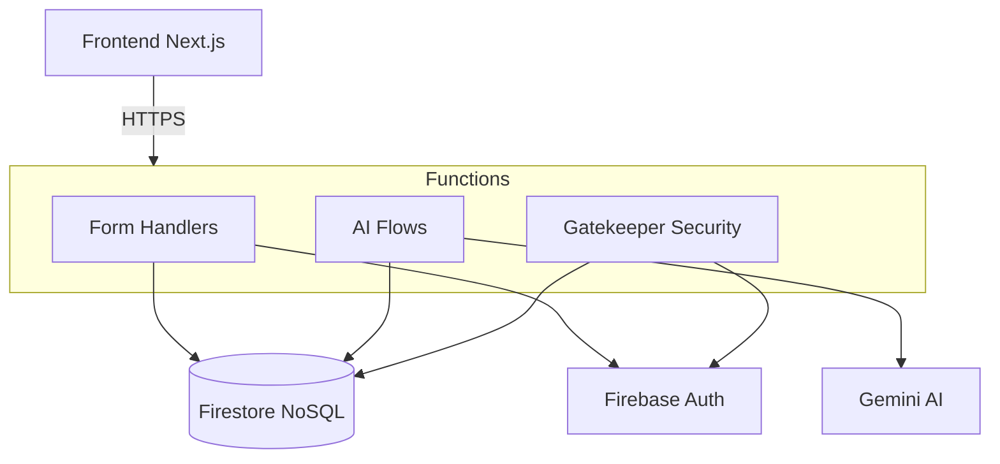
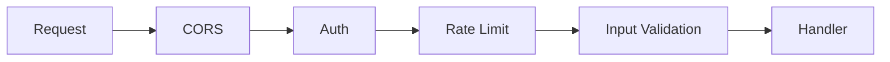

## What is CodeThe5?

CodeThe5 is an **AP Computer Science A exam preparation platform** that helps students master the exam through:

<CardGroup cols={2}>
  <Card title="Interactive Content" icon="book-open">
    Interactive syllabus content designed to engage students
  </Card>
  <Card title="AI Tutoring" icon="robot">
    AI-powered tutoring using the Socratic method
  </Card>
  <Card title="Practice System" icon="pen-to-square">
    Practice questions with instant grading and feedback
  </Card>
  <Card title="FRQ Grading" icon="code">
    AI-powered evaluation of Free Response Questions against rubrics
  </Card>
</CardGroup>

## What Does the Backend Do?

The backend is a **Python-based serverless application** running on Firebase Cloud Functions. It handles:

| Feature | What It Does |
|---------|--------------|
| **User Signup** | Processes waitlist forms, syncs to HubSpot CRM, creates Firebase Auth accounts |
| **Authentication** | Passwordless login via email links |
| **AI Tutoring** | Real-time chat with Gemini AI using Socratic teaching |
| **Practice System** | Serves questions, grades answers, tracks progress |
| **FRQ Grading** | AI-powered evaluation of code submissions against rubrics |
| **Rate Limiting** | Tier-based usage limits (FREE vs PAID) |

## Tech Stack



### Core Technologies

| Layer | Technology | Purpose |
|-------|------------|---------|
| **Runtime** | Python 3.13 | Backend language |
| **Platform** | Firebase Cloud Functions | Serverless compute |
| **Database** | Firestore | NoSQL document database |
| **AI/LLM** | Google Genkit + Gemini 2.0 | AI features |
| **Auth** | Firebase Auth | User authentication |
| **CRM** | HubSpot API | Lead management |
| **Email** | Firestore Trigger Email | Transactional emails |

## Codebase Layout

```bash
functions/
├── main.py                    # Entry point - all Cloud Functions
├── codethe5_backend/         # Main Python package
│   ├── config.py             # Configuration & constants
│   ├── exceptions.py         # Custom exception classes
│   ├── utils.py              # Shared utilities
│   ├── auth.py               # Firebase Auth helpers
│   ├── emails.py             # HTML email templates
│   ├── forms/                # Form handling
│   │   ├── waitlist_form.py  # Signup flow
│   │   ├── validators.py     # Input validation
│   │   ├── firestore.py      # Database operations
│   │   └── hubspot.py        # CRM integration
│   └── genkit/               # AI system
│       ├── endpoints.py      # HTTP endpoints
│       ├── gatekeeper.py     # Auth + rate limiting
│       ├── flows/            # AI logic
│       └── db/               # Data layer
└── tests/                    # Test suite (95% coverage)
```

## Key Endpoints

### Form Endpoints (Public)

| Endpoint | Method | Purpose |
|----------|--------|---------|
| `submit_waitlist` | POST | Process signup form |
| `request_sign_in_link` | POST | Send passwordless login email |
| `submit_feedback` | POST | Collect user feedback |

### AI Endpoints (Protected)

| Endpoint | Method | Purpose |
|----------|--------|---------|
| `tutor_chat` | POST | AI tutor conversation |
| `streaming_tutor` | POST/SSE | Streaming AI responses |
| `practice_serve` | POST | Serve/grade practice questions |
| `frq` | POST | FRQ submission and grading |
| `health` | GET | System health check |

<Note>
  Protected endpoints require a Firebase Auth token in the `Authorization: Bearer <token>` header.
</Note>

## Security Model

The backend has multiple security layers:



<Steps>
  <Step title="CORS">
    Restricts which domains can call the API
  </Step>
  <Step title="Authentication">
    Verifies Firebase ID tokens
  </Step>
  <Step title="Rate Limiting">
    Prevents abuse with tier-based limits
  </Step>
  <Step title="Input Validation">
    Sanitizes all user input
  </Step>
</Steps>

## Development Standards

### Code Quality

*   **95% test coverage** required (enforced by CI)
*   **Type hints** on all functions
*   **Docstrings** for public functions
*   **Logging** for debugging (use `logger` not `print`)

### Workflow

<Steps>
  <Step title="Branch">
    Create feature branch from `main`
  </Step>
  <Step title="Test">
    Write tests first (TDD encouraged)
  </Step>
  <Step title="Implement">
    Implement feature
  </Step>
  <Step title="Verify">
    Run `pytest` locally
  </Step>
  <Step title="PR">
    Open Pull Request
  </Step>
  <Step title="Merge">
    CI must pass before merge
  </Step>
</Steps>

## Quick Links

<CardGroup cols={2}>
  <Card title="Firebase Console" icon="fire" href="https://console.firebase.google.com">
    Manage database, auth, and functions
  </Card>
  <Card title="HubSpot Dashboard" icon="users" href="https://app.hubspot.com">
    View leads and contacts
  </Card>
  <Card title="Google AI Studio" icon="wand-magic-sparkles" href="https://aistudio.google.com">
    Experiment with Gemini models
  </Card>
  <Card title="Firestore Emulator" icon="database" href="http://localhost:4000">
    Local database interface
  </Card>
</CardGroup>

## Next Steps

<CardGroup cols={3}>
  <Card title="Quickstart" icon="rocket" href="/quickstart">
    Get your development environment running
  </Card>
  <Card title="Development" icon="code" href="/development">
    Learn the daily workflows
  </Card>
  <Card title="Architecture" icon="sitemap" href="/architecture">
    Deep dive into system design
  </Card>
</CardGroup>
